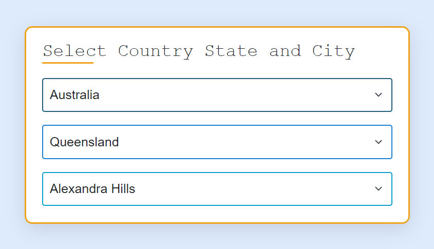
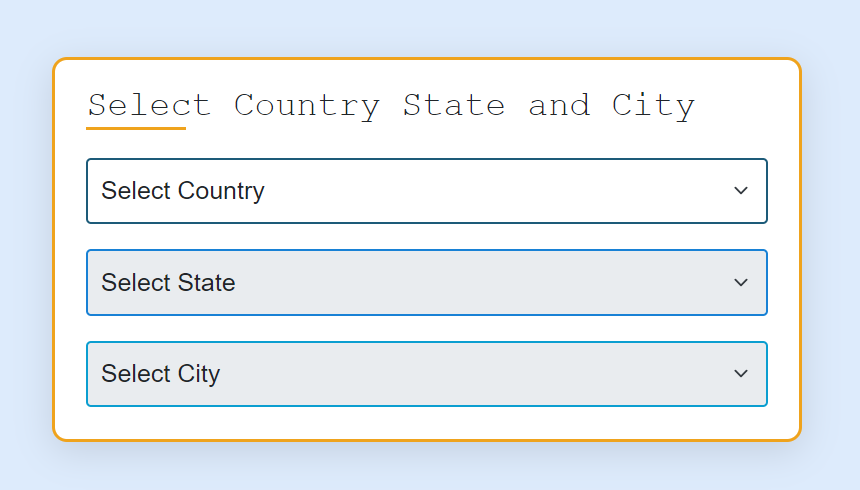

# Country State City Dependent Dropdown List using JavaScript and fetch API

### In this project I used Bootstra 5 for designing part. 

### This is a easy way to create a dynamic dependent dropdown list

 